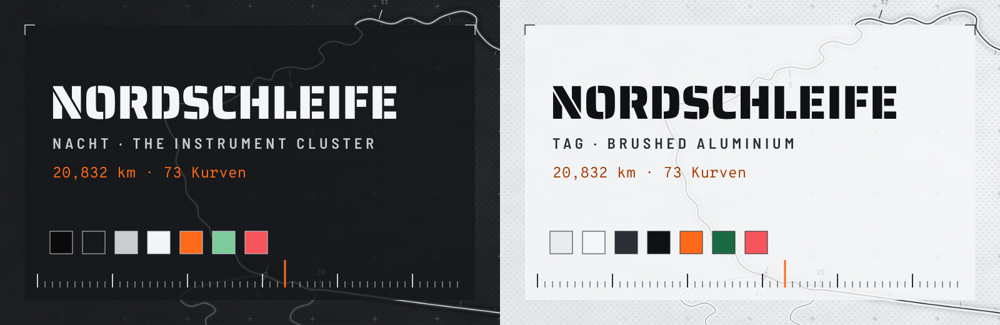

<p align="center"></p>

<p align="center"><sub>Grüne Hölle · 20,832 km<br>
73 Kurven · 300 m Höhenunterschied<br>
33 links · 40 rechts</sub></p>

# ■ NORDSCHLEIFE

The instrument cluster. An anthracite ground, aluminium structure, white numerals and **one orange needle** on whatever has the focus. Orange is never a light and never sits behind text. Right angles only: tick scales, crop marks, flat legend blocks. The wallpaper is the circuit's outline as a survey drawing; no car, badge or maker's mark.

| | |
|---|---|
| **nordschleife-nacht** | night: the dark cluster |
| **nordschleife-tag** | day: a brushed-aluminium dial with ink numerals |

## ■ Sektor 1 · Skala

| | | |
|---|---|---|
| **ground** | `#0A0A0B / #E9EBEE` | nacht / tag |
| **text** | `#F4F5F6 / #0F1113` | numerals |
| **aluminium** | `#C9CDD2 / #2B2F35` | structure, ticks |
| **needle** | `#FF6A1A` | the focus |
| **Kontrollgrün** | `#7CCB9A / #1A6B43` | data |
| **Warnrot** | `#F5555B` | failure |

## ■ Sektor 2 · Cockpit

- **Windows**: rounding 0; the focused border runs from the needle into aluminium
  and fades; no glow
- **Waybar**: three flat plates on a tick scale with crop marks; workspaces are
  numerals standing on the scale, the focused one with the orange needle
- **mawaqit**: a plate banner with a 270° prayer gauge, five major ticks for five
  prayers
- **yawm**: ■ overdue, ■ today, □ later, ¶ notes
- **hyprlock**: a stencil clock with running seconds, a lap scale with the needle on
  the minute, three sector bars that fill as the hour passes, one line of circuit facts
- **NordschleifeNachtNadel / NordschleifeTagNadel** cursors, matching icons,
  **GTK / Thunar** (the needle on the selected row), **swaync** with crop marks
- **Terminals**: Overpass Mono 10.5, an orange beam cursor; a zsh chain of legend
  blocks; tmux with a tick rule over the windows
- **Type**: Saira Stencil One, Barlow Semi Condensed, Overpass Mono, Noto Kufi Arabic

## ■ Sektor 3 · Abnahme

- Arch Linux (the package check uses `pacman`)
- Hyprland 0.56 or newer: the configuration is written in Lua
- waybar 0.15 or newer
- the packages in `nordschleife-nacht/packages.txt` (both variants need the same):

```sh
sudo pacman -S --needed $(grep -v '^#' nordschleife-nacht/packages.txt)
```

## ■ Start

> [!WARNING]
> This is a whole desktop, not a colour scheme. It replaces every file listed
> in `nordschleife-nacht/MANIFEST` or `nordschleife-tag/MANIFEST`: the Hyprland, waybar, terminal, tmux, GTK and fontconfig
> configuration among them, and the theme line in `~/.zshrc`.
> Everything it replaces is backed up first.

```sh
git clone https://github.com/houssemMekhelbi/hattin-nordschleife.git
cd hattin-nordschleife
./nordschleife-nacht/restore.sh --dry-run   # show what would change, touch nothing
./nordschleife-nacht/restore.sh             # apply nordschleife-nacht
./nordschleife-tag/restore.sh               # or nordschleife-tag
```

`restore.sh` then:

1. reports missing packages;
2. backs up every path it is about to replace to `~/themes/.backups/before-<variant>-<timestamp>/`;
3. copies the theme's `home/` over `$HOME` and removes the paths in its `ABSENT`;
4. points `~/.zshrc` at the theme's prompt;
5. applies its `gsettings.txt` and refreshes the font and icon caches;
6. builds the mawaqit-api image if it is missing, enables the user services and
   reloads Hyprland, waybar, hyprpaper, swaync and tmux.

`--files-only` copies the files and gsettings and leaves the services alone.

## □ Boxengasse

Back to the pits: copy the backup folder back over `$HOME`.

## □ Prayer times

Prayer times come from [mawaqit.net](https://mawaqit.net) through a local copy of
[mawaqit-api](https://github.com/mrsofiane/mawaqit-api), run by podman on 127.0.0.1.
List your mosques in `~/.config/mawaqit/mosques`, one `<mawaqit.net slug> | <label>`
per line; scroll or right-click the prayer module to switch between them.

## □ Other circuits

This is one of the hattin themes. They share one behaviour (binds, workspaces,
bar modules) and differ only in look. Clone several side by side and run the
`restore.sh` of the one you want: each switch removes what the previous theme
left that the new one does not use.

## □ Licence

MIT, see [LICENSE](LICENSE). The fonts in `<theme>/home/.local/share/fonts/` are
under the SIL Open Font License; each licence text sits next to its font.
mawaqit-api (`<theme>/home/.local/share/mawaqit-api/`) is MIT, © Sofiane Louchene.
